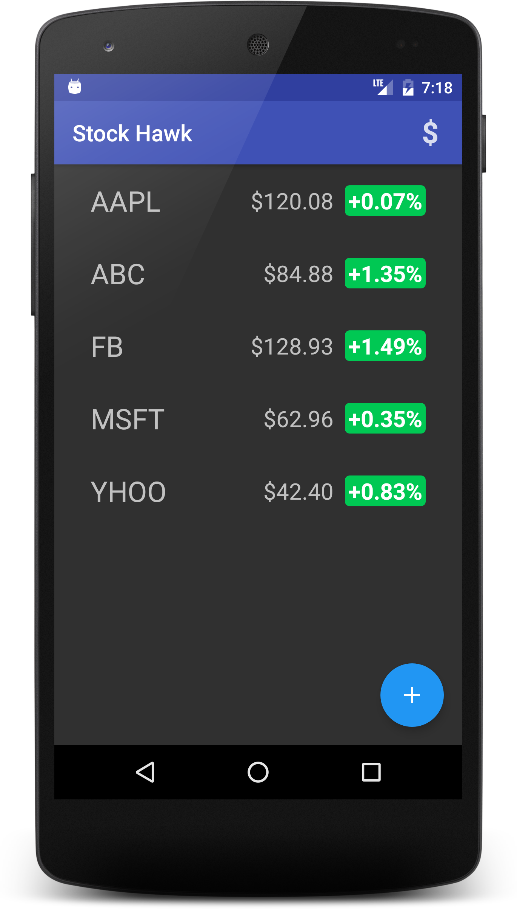
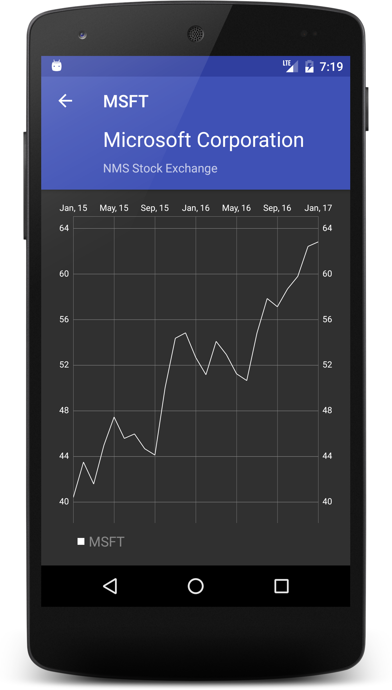

# UAND-P3
This directory has StockHawk application source code for Udacity Android Nanodegree program.

## Steps to import project

1. Clone the repository.
2. Navigate to path where the cloned repository exists.
3. Import project into Android Studio.
4. Build the project and run it.

## Screenshots

HomeScreen | DetailsScreen | Widget
--- | --- | ---
 |  | 
